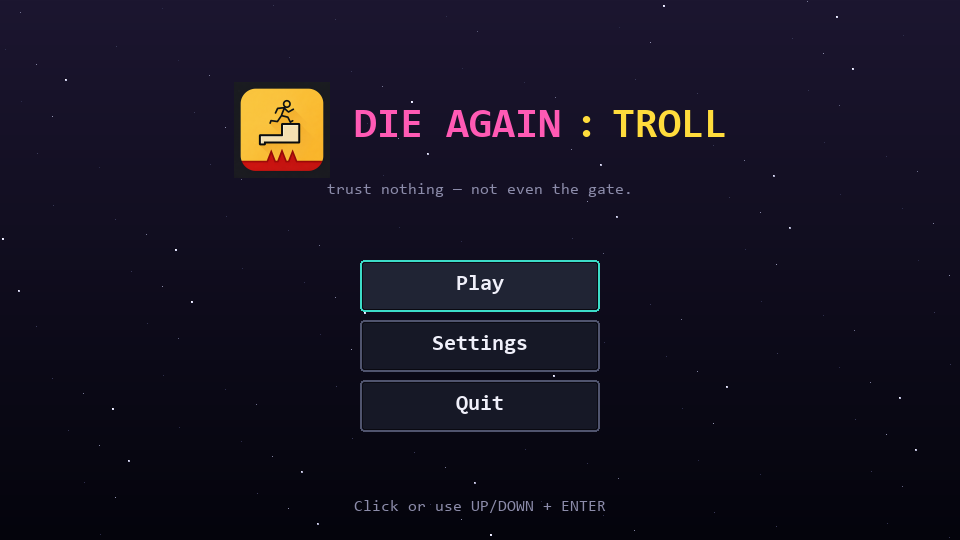
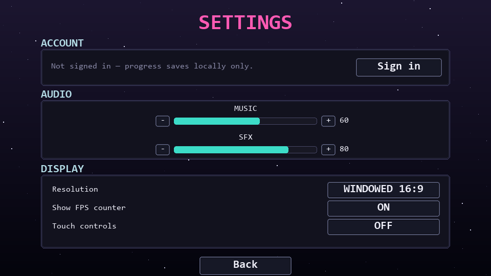
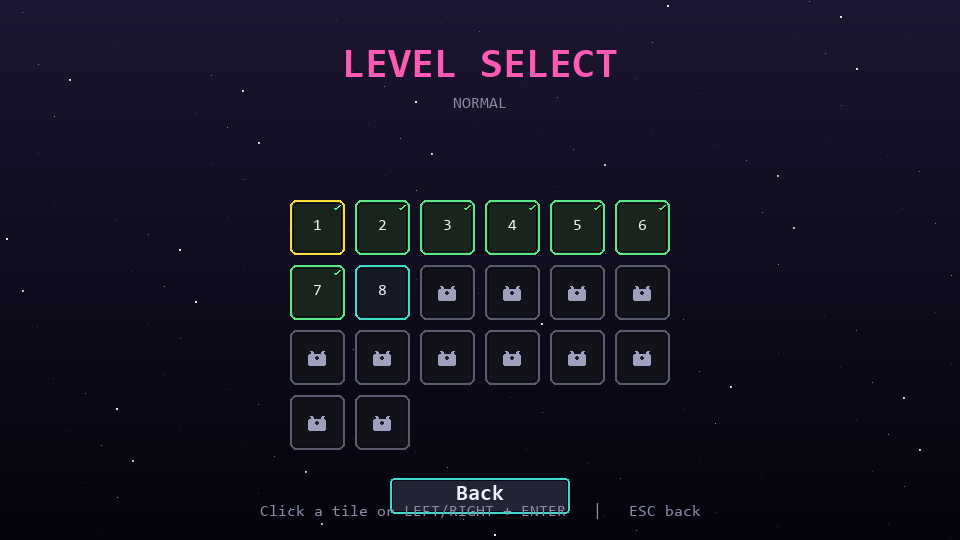
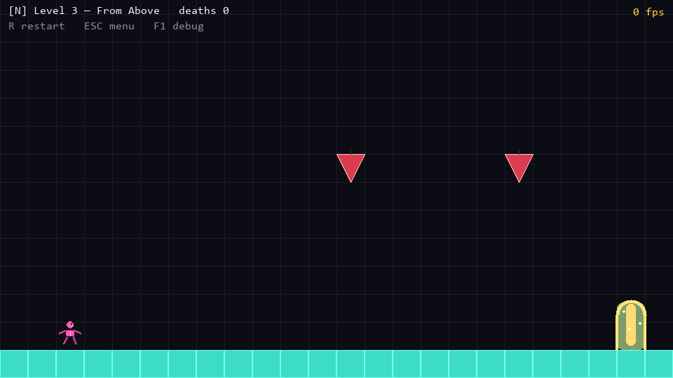

# Die Agail: Troll

A 2D rage-platformer in the spirit of *Cat Mario* and *Level Devil*. Every floor might collapse, every spike might be hidden, and at least one portal in every level is a lie. Trust nothing — not even the gate.

Built in **Python 3** + **Pygame-CE** following a [hand-written GDD](docs/Do_An_GDD_RagePlatformer.docx). All levels are JSON, all traps are extensible, and the game runs on Windows today with Android packaging planned.



## Download — Windows

**[⬇️ DieAgailTroll.exe (latest release)](https://github.com/HuyPham9199/die-again-troll/releases/latest)**

Single-file portable build — no installer, no Python required. Double-click to play on Windows 10/11.

> On first launch Windows SmartScreen may flag the .exe as "unrecognised" because it's an unsigned indie build. Click **More info → Run anyway**. Your save (`save.dat`) and account database (`game.db`) are created next to the .exe.

Current version: **v1.0.01**.

## Features

- **25 hand-crafted levels** in Normal mode with progressively cruel troll mechanics
- **5 Nightmare levels** unlocked after clearing 5 Normal levels (`floor(level / 5)` formula)
- **10 trap types**: hidden spikes, invisible blocks, fake floors, ceiling spikes, crushers, fake portals, ground spikes (erupt on contact), timed floors (crumble after 0.4s), falling blocks (instant drop), fake checkpoints (lethal "power-ups")
- **Reverse-control zones** that flip A↔D without warning
- **Account system** with local SQLite-backed register / login / sign out (architecture ready to swap for Supabase or Firebase)
- **Cloud-style sync**: progress + death counter persist per-user; `last_username` is remembered per-device
- **Modern UI**: card-based AuthState, in-game pause menu, animated portals, procedural player skeleton, parallax starfield background
- **Volume sliders** (Music + SFX) with live preview
- **FPS counter** togglable, refreshed every 5 seconds
- **Mobile-ready touch controls** (D-pad + jump button) — toggle in Settings, wired but disabled by default

## Screenshots

| | |
|---|---|
|  |  |
| Settings (Music/SFX/FPS/Touch) | Level Select with cleared check marks |
|  | |
| Gameplay — ceiling spike about to drop | |

## Quick start

Requires **Python 3.10+** and pip.

```bash
git clone https://github.com/HuyPham9199/die-again-troll.git
cd die-again-troll
pip install -r requirements.txt
python main.py
```

## Controls

| Action | Keyboard | Mobile / Touch |
|---|---|---|
| Move left / right | `A` `D` or `←` `→` | Bottom-left buttons |
| Jump | `Space` / `W` / `↑` | Bottom-right button |
| Restart level | `R` | — |
| Pause | `Esc` | — |
| Debug overlay (show trigger zones) | `F1` | — |

## Project layout

Follows the modular structure mandated by the GDD §2.1:

```
core/         engine (game loop, dt-decoupled), FSM, camera (trauma shake + frustum cull)
entities/     player, traps, portal — all draw themselves in float screen-space
levels/       map_parser + data/normal/*.json + data/nightmare/*.json
systems/      save_mgr (base64 save.dat), auth_db (SQLite), particle_pool, audio
states/       play_state (the actual game tick)
ui/           menus, widgets, settings_state, auth_state, pause_state,
              mobile_controls, branding
assets/       logo.png + audio/sfx/* + audio/music/*
```

## Audio

Drop `.mp3`, `.ogg`, or `.wav` files into `assets/audio/sfx/` and `assets/audio/music/` with the names listed in [`assets/audio/README.txt`](assets/audio/README.txt). Missing files fall back to silence — the game never crashes due to a missing sound.

## Adding levels

Drop a new JSON file in `levels/data/normal/`:

```json
{
  "level_id": 21,
  "name": "Your Level Name",
  "grid_size": 40,
  "player_spawn": [2, 11],
  "goal_pos": [22, 12],
  "decoy_goals": [[15, 12]],
  "reverse_zones": [[10, 9, 14, 13]],
  "layout": [
    [0,0,0,0,0,0,0,0,0,0,0,0,0,0,0,0,0,0,0,0,0,0,0,0],
    ... 14 rows of 24 tile codes ...
    [1,1,1,4,1,1,1,1,1,1,1,1,1,1,1,1,1,1,1,1,1,1,1,1]
  ]
}
```

**Tile codes**: `0` air · `1` solid · `2` hidden spike · `3` invisible block · `4` fake floor · `5` ceiling spike · `6` crusher · `7` ground spike (erupts on contact) · `8` timed floor (crumbles after 0.4s) · `9` falling block (drops when player enters its column)

**JSON extras** (optional arrays at top level):
- `decoy_goals: [[col, row], ...]` — portals that look real but kill on touch
- `fake_checkpoints: [[col, row], ...]` — rotating-star lures that kill on touch
- `reverse_zones: [[c0, r0, c1, r1], ...]` — invisible rectangles that flip A↔D

## Tech stack

- **Python 3.10+** with `from __future__ import annotations`
- **Pygame-CE 2.5+** (Community Edition required — uses newer GPU render path)
- **SQLite 3** (stdlib) for the local user database
- **requests** for the upcoming update checker / cloud sync HTTP layer

## Running tests

```bash
python _smoketest.py
```

The smoke test runs headless (no window), drives the full UI flow, asserts on trap behaviour, and isolates its save / db files in a temp directory so it never touches your real progress.

## License

MIT — see [LICENSE](LICENSE).

## Credits

- Game design + code: Huy Phạm
- Pixelated character sprite: <a href="http://www.freepik.com">Designed by Alekksall / Freepik</a> — used under the Freepik free license, attribution required
- Logo and audio assets: see individual file attributions in `assets/`
- Engine architecture: per the project's GDD (rage-platformer master blueprint)
